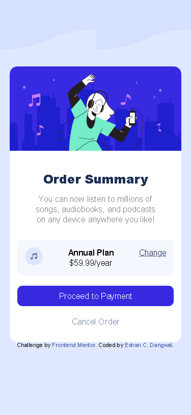

# Frontend Mentor - Order summary card solution

This is a solution to the [Order summary card challenge on Frontend Mentor](https://www.frontendmentor.io/challenges/order-summary-component-QlPmajDUj). Frontend Mentor challenges help you improve your coding skills by building realistic projects. 

## Table of contents

- [Overview](#overview)
  - [The challenge](#the-challenge)
  - [Screenshot](#screenshot)
  - [Links](#links)
- [My process](#my-process)
  - [What I learned](#what-i-learned)
  - [Continued development](#continued-development)
- [Author](#author)

**Note: Delete this note and update the table of contents based on what sections you keep.**

## Overview

### The challenge

Users should be able to:

- See hover states for interactive elements

### Screenshot

-Desktop


-Mobile




### Links

- Solution URL: [solution URL](https://your-solution-url.com)
- Live Site URL: [https://eshan01.github.io/Order-summary/](https://eshan01.github.io/Order-summary/)

## My process

### Built with

- Semantic HTML5 markup
- CSS custom properties
- Flexbox
- Grid Box

### What I learned

Use of background image and position of the image in the background. I also learned to place a div in the centre of the website.

```css
body{
    background-image: url("./images/pattern-background-mobile.svg");
    background-repeat:repeat-x;
    background-size: 50%;
    background-position: top left;
    display: grid;
    place-content: center;
    background-color: var(--Pale-blue);
}
```


### Continued development

There are many things in CSS as well as in HTML. However, Flexbox and grid layout are some of the things which I want to improve.


## Author

- Frontend Mentor - [@Eshan01](https://www.frontendmentor.io/profile/Eshan01)
